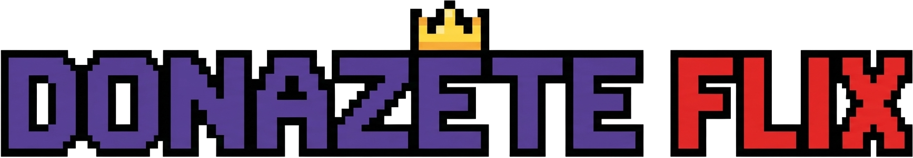
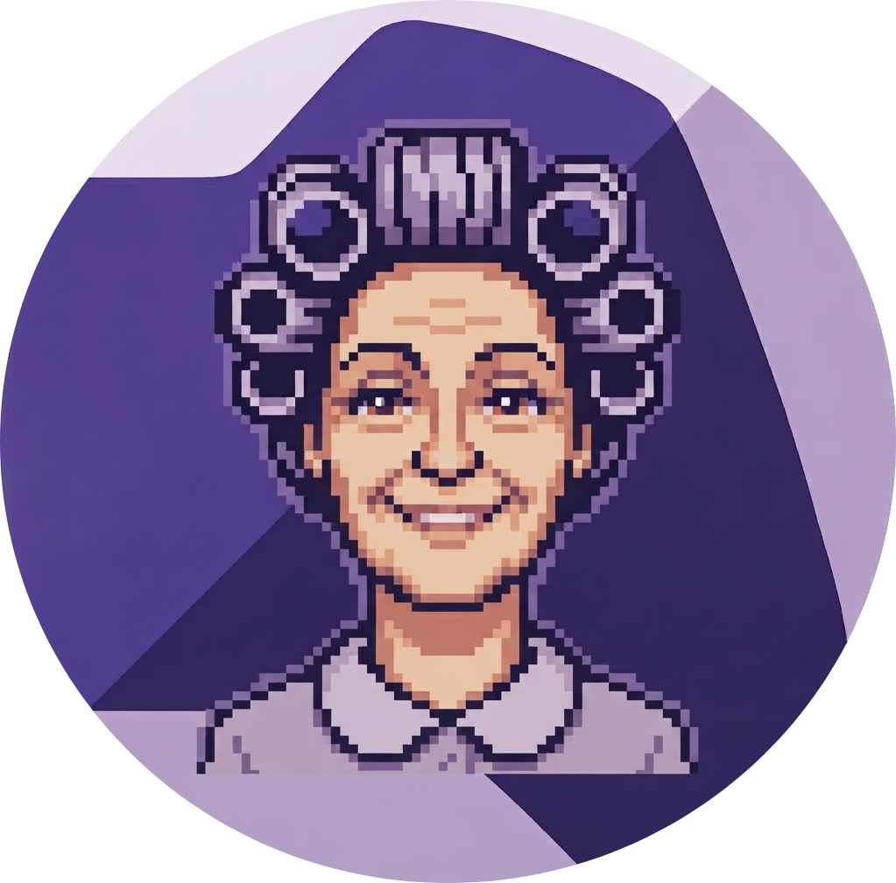
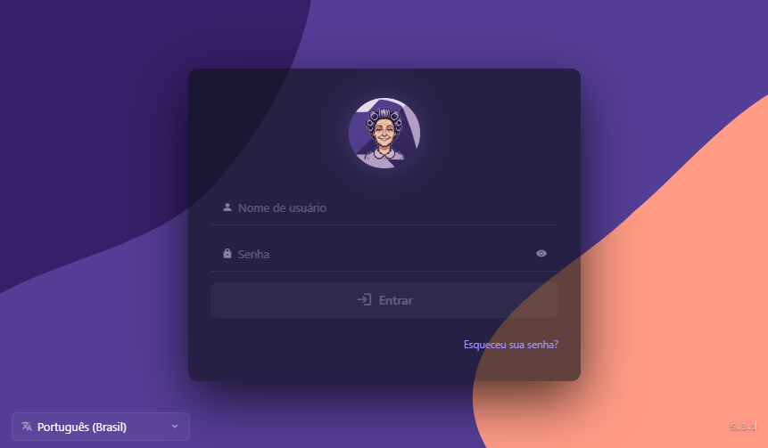
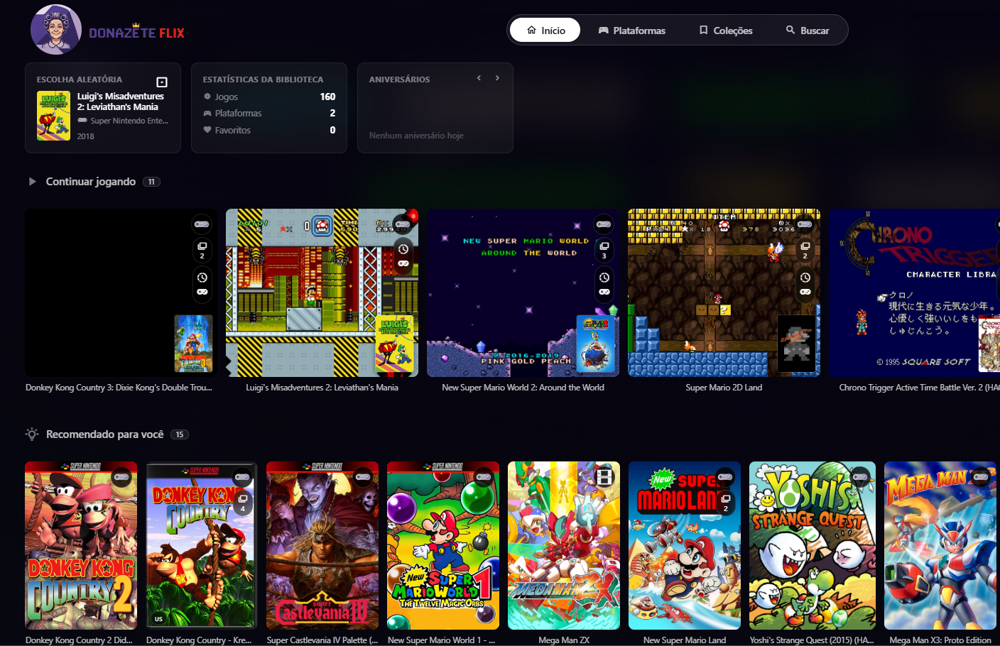
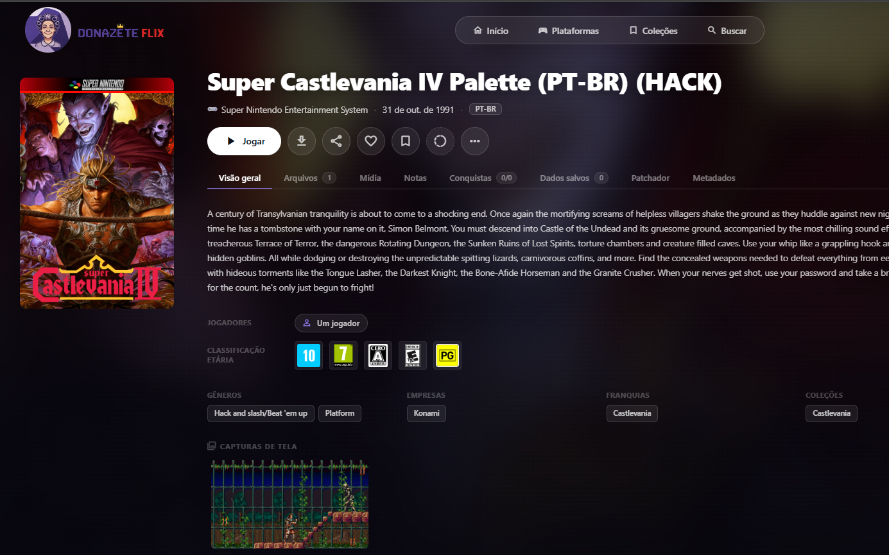
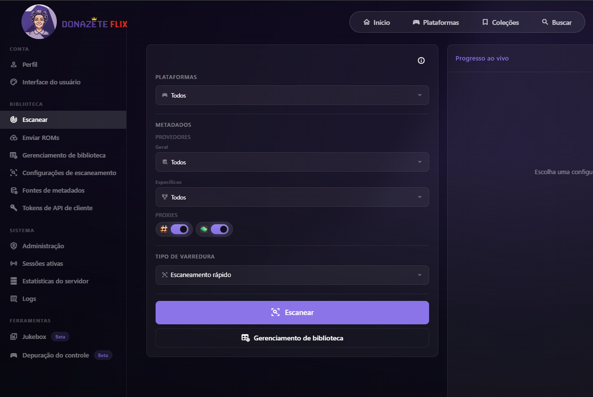
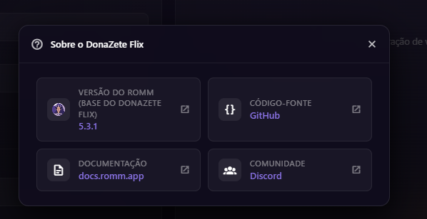

[](https://hub.docker.com/r/alanmugiwara/donazeteflix)
[](https://github.com/rommapp/romm)
[](https://github.com/alanmugiwara/donazeteflix?tab=AGPL-3.0-1-ov-file)
[](https://github.com/alanmugiwara/donazeteflix)
[](https://github.com/alanmugiwara/donazeteflix)
[](https://github.com/alanmugiwara/donazeteflix)
[](https://github.com/alanmugiwara/donazeteflix)
[](https://github.com/alanmugiwara/donazeteflix)
[](https://hub.docker.com/r/alanmugiwara/donazeteflix)

<br>

# Uma Netflix para Retro Gamers! 
DonaZete Flix é uma distribuição customizada do [RomM](https://github.com/rommapp/romm): escaneia sua biblioteca de ROMs no disco, enriquece os metadados a partir de diversos provedores previamente habilitados, e entrega tudo em uma interface web para navegar, jogar, manter seu progresso, ter estimativas de tempo de gameplay, sistema moderno de conquistas e tudo isso sem instalar nada, rodando pelo navegador!

O nome Dona Zete é uma homenagem especial à dona de uma locadora de videogames da rua em que eu morava na infância e onde eu alugava cartuchos. Foi em lugares como aquele que muitos dos jogos que hoje fazem parte da minha coleção começaram a fazer parte da minha história. Dar esse nome ao projeto é uma forma de preservar não apenas os jogos, mas também uma pequena lembrança dessa época.

Mais do que uma customização do RomM, o DonaZete Flix é uma homenagem à experiência de descobrir e alugar videogames na infância, trazendo essa memória para uma biblioteca digital moderna, e é claro... tudo o mais matigado possível a respeito de configuração. <br>


---

## Funcionalidades

- **Biblioteca organizada:** escaneia automaticamente sua pasta de ROMs e organiza por plataforma.
- **Metadados ricos:** integração com IGDB, ScreenScraper, MobyGames, SteamGridDB, RetroAchievements, LaunchBox, HowLongToBeat, Hasheous, PlayMatch e mais.
- **Joague no navegador:** emulação via EmulatorJS, RuffleRS (Flash) e js-dos direto na interface web.
- **Saves na nuvem:** upload e sync de saves, states e screenshots pela interface.
- **Conquistas:** acompanhamento de progresso no RetroAchievements.
- **Multi-usuário:** sistema de autenticação com suporte a OIDC e diferentes níveis de permissão.
- **Pronto para Docker:** imagem publicada no Docker Hub, configuração por variáveis de ambiente.

---

## Screenshots

<br>
<br>
<br>
<br>
<br>

---

## Stack

- [RomM](https://github.com/rommapp/romm) - base do projeto (ROM manager + player)
- [Python](https://www.python.org/) + [FastAPI](https://fastapi.tiangolo.com/) - backend
- [Vue 3](https://vuejs.org/) + [Vite](https://vitejs.dev/) - frontend
- [MariaDB](https://mariadb.org/) - banco de dados
- [Valkey/Redis](https://valkey.io/) - cache e filas de tarefas
- [Docker](https://www.docker.com/) ou [Podman](https://podman.io/) - empacotamento e deploy

---

## Deploy rápido com Docker Compose ou Podman Compose

### 1. Baixe os arquivos de configuração

```bash
mkdir donazeteflix && cd donazeteflix
curl -O https://raw.githubusercontent.com/alanmugiwara/donazeteflix/main/app/docker-compose.yml
curl -o .env.exemple https://raw.githubusercontent.com/alanmugiwara/donazeteflix/main/app/.env.exemple
```

### 2. Configure suas variáveis de ambiente

Renomeie o `.env.exemple` para  `.env` e edite-o com suas credenciais:

```env
## scrappers ##
SCREENSCRAPER_USER=seu-usuario
SCREENSCRAPER_PASSWD=sua-senha
SCREENSCRAPER_DEV_ID=seu-dev-id
SCREENSCRAPER_DEV_PASSWD=sua-dev-senha
RETROACHIEVEMENTS_API_KEY=sua-api-key
ROMM_AUTH_SECRET_KEY=gere-com-openssl-rand-hex-32
STEAMGRIDDB_API_KEY=sua-api-key
IGDB_CLIENT_ID=seu-client-id
IGDB_CLIENT_SECRET=seu-client-secret

## services ##
HLTB_API_ENABLED=true
MARIADB_ROOT_PASSWD=senha-root-forte
DB_PASSWD=senha-do-banco

## locations ##
DONAZETFLIX_LIBRARY=/caminho/para/sua/pasta/de/roms
DONAZETFLIX_ASSETS=donazetflix_assets
DONAZETFLIX_CONFIG=donazetflix_config
```

> Para gerar o `ROMM_AUTH_SECRET_KEY`, rode:

``` bash
openssl rand -hex 32
```

### 3. Entre no diretório do projeto e suba os containers

```bash
docker compose up -d
```

```bash
podmam-compose up -d
```

A interface estará disponível em `http://localhost:8081`.

---

## Imagem Docker

A imagem está publicada no Docker Hub:

[](https://hub.docker.com/r/alanmugiwara/donazeteflix)

## Estrutura de volumes

| Volume | Descrição |
|---|---|
| `donazetflix_mysql_data` | Dados do banco MariaDB |
| `donazetflix_resources` | Capas, screenshots e assets buscados dos provedores |
| `donazetflix_redis_data` | Cache para tarefas em background |
| `$DONAZETFLIX_LIBRARY` | Sua biblioteca de ROMs (bind-mount) |
| `$DONAZETFLIX_ASSETS` | Saves, states e screenshots dos usuários |
| `$DONAZETFLIX_CONFIG` | Arquivo `config.yml` da instância |

---

## Provedores de metadados habilitados por padrão

- IGDB
- ScreenScraper
- RetroAchievements
- SteamGridDB
- Hasheous
- PlayMatch
- LaunchBox
- HowLongToBeat (HLTB)

---

## Building e criação da sua própria imagem

- Baixe este redpositório e entre no diretório do projeto
``` bash
git clone https://github.com/alanmugiwara/donazeteflix \
&& cd donazeteflix
```
- Faça o build da imagem e rode localmente
``` bash
docker buildx build \
--no-cache \
--platform linux/amd64,linux/arm64 \
--target full-image \
--tag alanmugiwara/donazeteflix:0.1 \
--file docker/Dockerfile \
--load \
 .
 ```
- Suba os containers
``` bash
 docker compose up -d
  ```
### Se você quer apenas buildar localmente para testar com docker compose, faça para a arquitetura da sua máquina, pois o `--load` não funciona com `--platform linux/amd64,linux/arm64` para carregar um manifest multiarch no Docker local.

 - Se preferir fazer o build e subir para o seu Docker Hub (AMD64)
``` bash
docker buildx build \
--no-cache \
--platform linux/amd64 \
--target full-image \
--tag SEU-USUARIO/NOME-DO-SEU-PROJETO:VERSAO-DO-PROJETO \
--file docker/Dockerfile \
--push \
 .
 ```

  - Se preferir fazer o build e subir para o seu Docker Hub (ARM64)
``` bash
docker buildx build \
--no-cache \
--platform linux/arm64 \
--target full-image \
--tag SEU-USUARIO/NOME-DO-SEU-PROJETO:VERSAO-DO-PROJETO \
--file docker/Dockerfile \
--push \
 .
 ```

## Contato

<div>
  <a href="https://instagram.com/alancruz_tec" target="_blank"></a>
  <a href="mailto:contato@alancruztec.com.br"></a>
  <a href="https://linkedin.com/in/alansilvadacruz" target="_blank"></a>
  <a href="https://alancruztec.com.br" target="_blank"></a>
</div>

---

## Licença

Este projeto é licenciado sob a [GPL-3.0 License](https://github.com/alanmugiwara/donazeteflix?tab=GPL-3.0-1-ov-file).

DonaZete Flix é um fork do [RomM](https://github.com/rommapp/romm), que também é distribuído sob GPL-3.0.